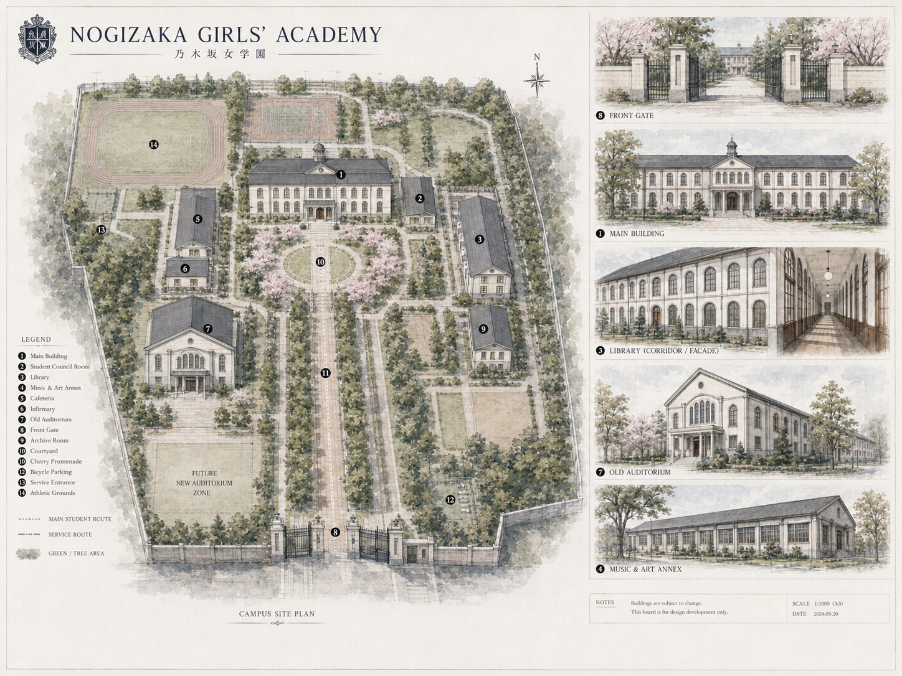

# 乃木坂女学院｜Campus Map V1（暂定定稿）

> 本文件对应校园概念图板 V1。该版作为当前阶段的空间基线：以现实名门女子校的总体秩序与动线为参考，建筑外形与布局则为本企划的虚构整合。

图片资产：`docs/assets/campus/nogizaka-campus-map-v1.png`

## 一、总体原则

- 主轴清晰、秩序明确，体现名门女学院的仪式感。
- 建筑整体采用**大正风**方向：简洁、优雅、克制，避免过强的维多利亚或巴洛克装饰感。
- 校园正面强调“被看见的学院秩序”，侧面与后部保留更生活化、身体化、后勤化的空间。
- 旧礼堂位于主轴西侧，相对独立但仍处在核心生活圈内，方便成为第10集的情感与制度冲突中心。
- 旧礼堂附近预留“未来新礼堂区”，为第10—12集的变化与回收提供空间依据。

## 二、主要建筑与功能

### 1. Main Building｜主教学楼

- 位于校园中轴偏北，是主轴尽头的视觉中心。
- 承担学校的正式面貌，是访客、新生与典礼视角中最重要的建筑。
- 内含主要 Home Room、普通课程教室、教师办公室、校长室与部分行政空间。
- 第一集开学日、第2集课堂生活、毕业阶段的制度性场景均大量使用。

### 2. Student Council Room｜学生会室

- 位于主教学楼东侧近处，靠近学校中枢但略有独立性。
- 方便樱井、真夏、若月频繁进出，又不会像行政办公室一样完全公开。
- 学生会工作、文化祭执行、旧礼堂意见整理、毕业交接均以此为基地。

### 3. Library｜图书馆

- 位于校园东侧，与主楼保持适度距离。
- 是桥本奈奈未的重要气质空间，也适合飞鸟、西野、自习生等安静停留。
- “去图书馆”应是一个小小的主动选择，但仍在课间可达范围内。

### 4. Music & Art Annex｜音乐与美术别馆

- 位于校园东南侧，是全校共享的专业艺术资源建筑。
- 承担音乐教室、练习室、合唱/器乐空间、美术室、工艺工作区及部分排练空间。
- 服务生田、万理华、西野、中元等艺术履修线。
- 本校采用“统一高等科 + 深度选修”，因此这里不是独立“艺术科大楼”。

### 5. Cafeteria｜食堂

- 位于主楼西侧生活区，与主教学楼不远，但足以形成独立的午间生态。
- 是不同班级、不同履修路线重新汇合的重要公共空间。
- 松村、南、高山以及松重丰角色都可在此形成稳定日常。

### 6. Infirmary｜保健室

- 位于食堂附近的较小建筑或附属空间。
- 适合承接身体状态、短暂逃离学校身份、休息与低声交流的场景。
- 与石原里美、磯村勇斗等角色的使用逻辑相连。

### 7. Old Auditorium｜旧礼堂

- 位于主轴西南侧，是校园最重要的情感性建筑之一。
- 建筑风格为简洁、庄重的大正风，不采用过度教堂化或巴洛克式装饰。
- 第一集仍作为开学典礼会场；轮椅新生进场困难的伏笔在此发生。
- 文化祭前后仍可承担小规模排练、创作与后台活动。
- 第10集正式面对“建筑可以继续存在，但已无法继续承担大型礼堂功能”的现实。

### 8. Front Gate｜正门

- 位于校园最南端，是中央主轴起点。
- 第一集新生进入、最终回一期生离开，都必须反复使用。
- 它同时是“成为这里的人”与“不再每天回到这里”的门槛。

### 9. Archive Room｜校史资料室 / 档案室

- 位于东南偏安静位置。
- 保存校史、旧照片、建筑档案、历届资料等。
- 服务宫崎葵角色、旧礼堂资料调查以及毕业整理场景。

### 10. Courtyard｜中庭

- 位于主教学楼前的中央庭院。
- 是视觉上最有秩序感的公共空间之一。
- 适合等人、短谈、拍照、集合、新生引导及“漂亮但仍然真实生活着”的校园日常。

### 11. Cherry Promenade｜樱花步道 / 主林荫道

- 从正门一路通向中庭与主楼，构成校园最重要的纵向主轴。
- 第一集入校、平日放学汇合、毕业前夕、最终回离校均可重复出现。
- 随着季节与剧情变化，同一条路应逐渐积累情感意义。

### 12. Bicycle Parking｜自行车停放区

- 位于东南侧靠边区域。
- 用来提醒观众：再名门的学校，也仍是学生每天具体到达、停车、迟到、忘东西的生活场所。

### 13. Service Entrance｜后勤 / 辅助入口

- 位于校园西侧偏后区域。
- 服务文化祭物资、舞台设备、餐饮后勤、维修人员及外部工作人员出入。
- 适合拍摄“正面优雅，后台混乱”的反差。

### 14. Athletic Grounds｜运动场

- 位于校园西北部，与教学主轴有所分离。
- 服务江口洋介的体育线、跑步、训练、接力等身体性段落。
- 体育场一旦进入剧情，画面与节奏都应明显区别于主教学区。

## 三、空间分区与关系

### A. “名门的脸”：正门 → 樱花步道 → 中庭 → 主教学楼

正门（8）→ 樱花步道（11）→ 中庭（10）→ 主教学楼（1）形成最强的中央主轴。

这里是学校对外展示秩序、传统与审美的区域，也最容易出现“宣传册里的乃木坂女学院”。第一集应先让观众相信这层完美，再逐渐让后台生活进入画面。

### B. “制度与安静”：主楼东侧

学生会室（2）、图书馆（3）、校史资料室（9）集中在东侧。

这一区域更偏学习、文书、判断与制度，天然适合樱井、真夏、桥本等人的路线交叉。

### C. “生活与记忆”：主楼西侧

食堂（5）、保健室（6）、旧礼堂（7）位于西侧。

这里比中央主轴更有人情味，也更适合吃东西、绕路、偷闲、搬东西、后台事故和偶遇。旧礼堂位于这一侧尤其重要：它并非被封存在校园角落，而是一直参与学生日常。

### D. “艺术性的偏离”：东南别馆

音乐与美术别馆（4）为生田、万理华、西野等提供相对远离主楼规范节奏的创作空间。

它仍属于学校制度，却允许声音、材料、作品和人的状态比主楼更不整齐。

### E. “身体与松弛”：校园后部

运动场（14）与校园后部开阔区域承担身体性、天气、速度与疲劳。

这里代表另一种学校经验：不是坐好、站齐、回答正确，而是跑、喘、晒、摔倒和继续。

## 四、主要人物动线的初步含义

- **樱井玲香**：主教学楼 ↔ 学生会室 ↔ 中庭，是最“制度中心”的移动路线。
- **秋元真夏**：比樱井路线更杂，学生会室、主楼、后勤入口、文化祭各区都可能出现，体现她的执行网络。
- **桥本奈奈未**：主楼 ↔ 图书馆最自然，也可因实际事务进入学生会/资料室区域。
- **生田绘梨花**：Home Room ↔ 艺术别馆；文化祭阶段再延伸到旧礼堂地下音乐空间。
- **伊藤万理华 / 西野七濑**：艺术别馆与校园边缘、展陈空间之间移动；西野尤其适合偶尔走非主轴路线。
- **松村沙友理**：几乎能合理出现在食堂、不同班级、学生会附近、文化祭后台等多个节点，她本身就是信息流。
- **高山一実 / 和田まあや**：普通教学区、食堂、运动区都适合形成喜剧场面。
- **星野南 / 斋藤飞鸟**：一个总能找到舒服角落，一个总站在人群边缘；两人可以共享很多“不是正式目的地”的空间。

## 五、与12集结构的关系

- **EP01《入学》**：正门（8）、樱花步道（11）、中庭（10）、旧礼堂（7）。
- **EP02《裙摆》**：主教学楼（1）及普通课堂空间，强调“这里真的要上学”。
- **EP03—05 文化祭线**：学生会室（2）、艺术别馆（4）、后勤入口（13）、旧礼堂（7）形成多点联动。
- **EP06《放学以后》**：校园空间退到起点/终点，人物更多进入校外。
- **EP07《夏天》**：运动与户外空间扩展到校外。
- **EP08《为什么要跑？》**：运动场（14）与校园外围、校外道路连成接力路线。
- **EP09《选择》**：学校无法解决“毕业以后”的问题，空间开始显得像一个即将离开的容器。
- **EP10《旧礼堂》**：旧礼堂（7）与未来新礼堂区成为核心。
- **EP11—12**：主楼、资料室、学生会室、食堂、正门、主轴步道逐一回收，完成制度交接与离校。

## 六、当前锁定与后续细化

### Campus Map V1 先行锁定

以下内容在后续写作中默认保持一致，除非编剧室明确改版：

- 校园中央主轴关系；
- 各主要建筑的大体相对位置；
- 旧礼堂位于西南生活区；
- 艺术别馆位于东南；
- 运动场位于西北；
- 正门位于南端；
- 新礼堂建设区与旧礼堂保持空间上的直接关联；
- 建筑整体审美采用**简洁、优雅的大正风**。

### 后续仍需细化

1. 主教学楼内部楼层和 Home Room 分配；
2. 学生会室、图书馆、艺术别馆之间的实际步行时间；
3. 连廊、楼梯、可视窗线与雨天路线；
4. 艺术别馆内部音乐室、美术室、练习室、材料室的关系；
5. 旧礼堂后台与地下音乐空间；
6. 运动场与校外接力路线衔接；
7. 新礼堂无障碍通道、轮椅观众位置与旧材料再利用的具体位置。

## 七、编剧使用原则

Campus Map V1 不是施工图，而是**空间连续性圣经**。

以后设计桥段时，应优先问：

> 这个人物为什么会在这里？她从哪里来？走过去需要多久？她途中会遇到谁？

而不是为了对白方便，把人物随时传送到任何地点。

空间本身应该帮助我们产生戏，而不是在写完戏以后被迫迁就剧情。